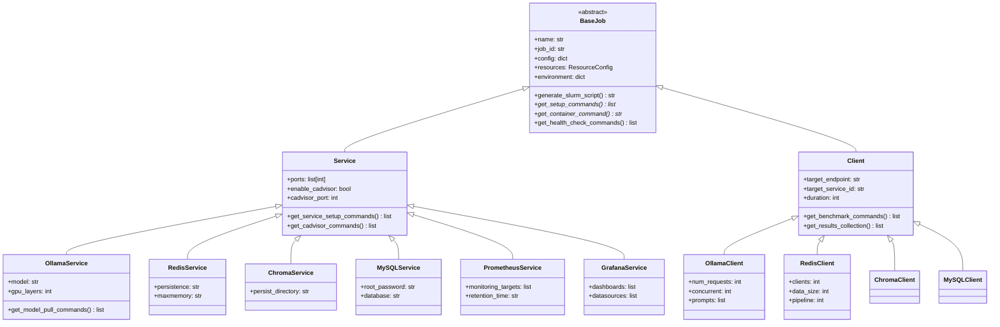
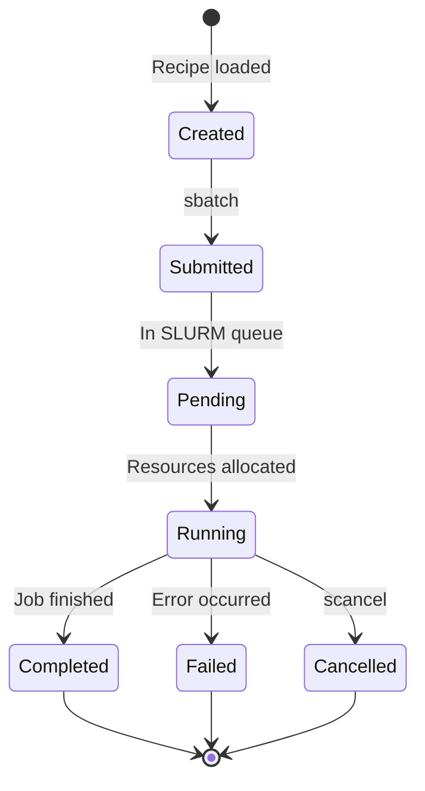

# Job Hierarchy

## Overview

The orchestrator uses a hierarchical job system where all deployable units inherit from a common base class. This enables consistent SLURM script generation while allowing service-specific customization.

## Job Class Hierarchy



## SLURM Script Generation

Each job generates a complete SLURM batch script following this template:

```bash
#!/bin/bash
#SBATCH --job-name=ollama_abc123
#SBATCH --account=p200981
#SBATCH --partition=gpu
#SBATCH --qos=default
#SBATCH --nodes=1
#SBATCH --ntasks=1
#SBATCH --cpus-per-task=4
#SBATCH --mem=16G
#SBATCH --time=02:00:00
#SBATCH --gres=gpu:1
#SBATCH --output=slurm-%j.out
#SBATCH --error=slurm-%j.err

# Environment setup
module purge
module load Apptainer/1.2.4-GCCcore-12.3.0

# Service-specific setup (from get_setup_commands)
export OLLAMA_HOST=0.0.0.0:11434
export OLLAMA_MODELS=$HOME/.ollama/models

# Container execution (from get_container_command)
apptainer exec --nv \
    --bind $HOME/.ollama:/root/.ollama \
    $HOME/containers/ollama_latest.sif \
    ollama serve &

# Health check (from get_health_check_commands)
sleep 10
curl -s http://localhost:11434/api/tags

# Keep running
wait
```

## Script Generation Methods

### `generate_slurm_script()`

The main template method that assembles the complete script:

```python
def generate_slurm_script(self) -> str:
    script = []
    script.append("#!/bin/bash")
    script.extend(self._generate_slurm_header())
    script.extend(self._generate_module_loads())
    script.extend(self.get_setup_commands())        # Hook
    script.extend(self.get_container_command())     # Hook
    script.extend(self.get_health_check_commands()) # Hook
    return '\n'.join(script)
```

### `get_setup_commands()`

Service-specific environment and preparation:

=== "Ollama"
    ```python
    def get_setup_commands(self):
        return [
            "export OLLAMA_HOST=0.0.0.0:11434",
            "export OLLAMA_MODELS=$HOME/.ollama/models",
            "mkdir -p $HOME/.ollama/models",
        ]
    ```

=== "Redis"
    ```python
    def get_setup_commands(self):
        return [
            "export REDIS_PORT=6379",
            "mkdir -p $HOME/redis/data",
            "mkdir -p $HOME/redis/logs",
        ]
    ```

=== "Prometheus"
    ```python
    def get_setup_commands(self):
        return [
            "mkdir -p $HOME/prometheus/data",
            "mkdir -p $HOME/prometheus/config",
            "cat > $HOME/prometheus/config/prometheus.yml << EOF",
            "...",
            "EOF",
        ]
    ```

### `get_container_command()`

The Apptainer execution command:

=== "Ollama (GPU)"
    ```python
    def get_container_command(self):
        return """
        apptainer exec --nv \\
            --bind $HOME/.ollama:/root/.ollama \\
            $HOME/containers/ollama_latest.sif \\
            ollama serve &
        """
    ```

=== "Redis (CPU)"
    ```python
    def get_container_command(self):
        return """
        apptainer exec \\
            --bind $HOME/redis/data:/data \\
            $HOME/containers/redis_latest.sif \\
            redis-server --bind 0.0.0.0 --port 6379 &
        """
    ```

## Resource Configuration

Resources are specified in recipes and mapped to SLURM directives:

| Recipe Field | SLURM Directive | Description |
|--------------|-----------------|-------------|
| `nodes` | `--nodes` | Number of nodes |
| `ntasks` | `--ntasks` | Number of tasks |
| `cpus_per_task` | `--cpus-per-task` | CPUs per task |
| `mem` | `--mem` | Memory allocation |
| `time` | `--time` | Time limit |
| `partition` | `--partition` | SLURM partition |
| `qos` | `--qos` | Quality of service |
| `gres` | `--gres` | Generic resources (GPU) |

Example recipe resources:

```yaml
resources:
  nodes: 1
  ntasks: 1
  cpus_per_task: 4
  mem: "16G"
  time: "02:00:00"
  partition: gpu
  qos: default
  gres: "gpu:1"
```

## cAdvisor Integration

Services can enable cAdvisor for container monitoring:

```yaml
service:
  name: ollama
  enable_cadvisor: true
  cadvisor_port: 8080
```

When enabled, the generated script includes:

```bash
# Start cAdvisor sidecar
apptainer exec \
    --bind /sys:/sys:ro \
    --bind /var/lib/docker:/var/lib/docker:ro \
    $HOME/containers/cadvisor.sif \
    /usr/bin/cadvisor \
    --port=8080 \
    --docker_only=true &
```

## Job Lifecycle



---

Next: [Services Overview](../services/overview.md)
