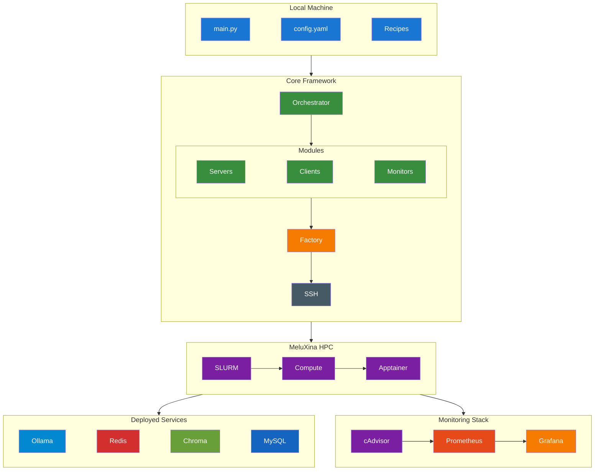
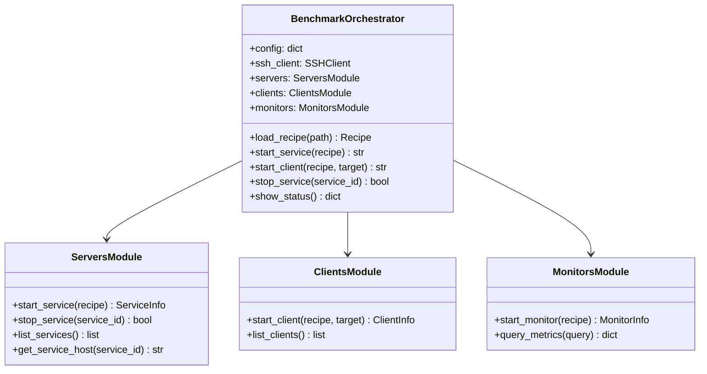
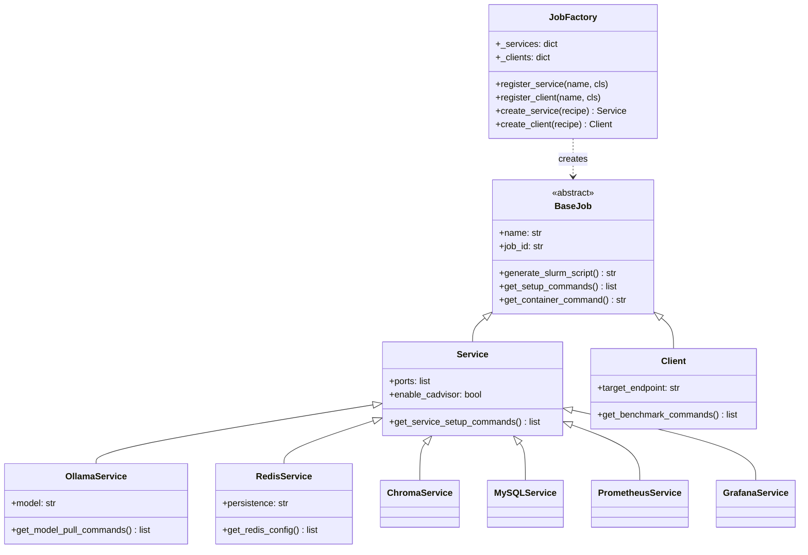
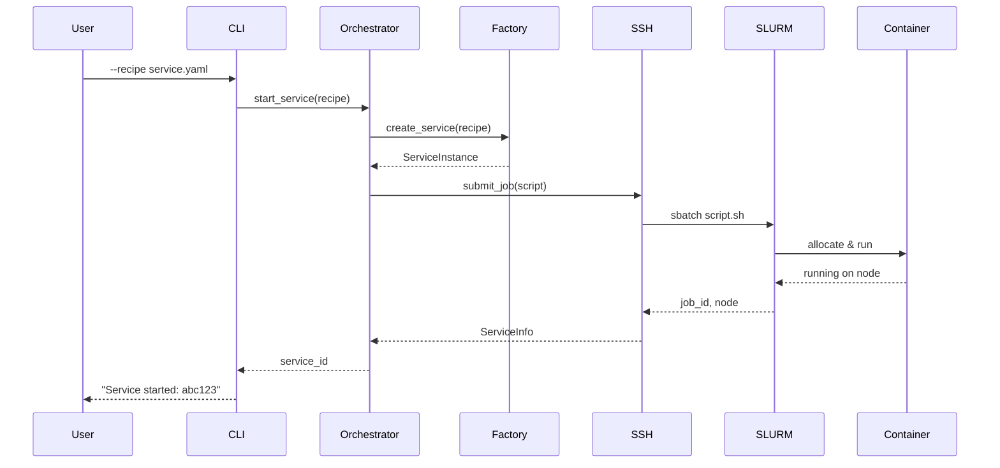
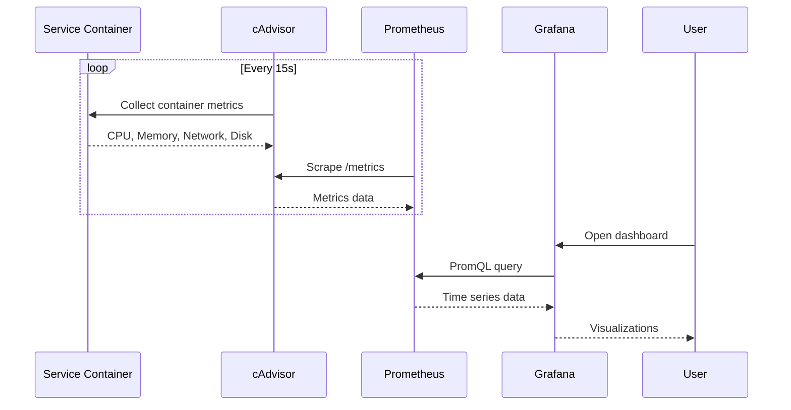

# System Architecture

## Overview

The HPC AI Benchmarking Orchestrator uses a **modular architecture** designed for flexibility, extensibility, and seamless HPC integration. The system orchestrates containerized AI workloads through SLURM, providing automated deployment, monitoring, and benchmarking capabilities.

## High-Level Architecture



## Core Components

### 1. CLI Interface (`main.py`)

The command-line interface provides the primary user interaction point.

**Responsibilities:**

- Parse command-line arguments
- Load and validate configuration
- Route commands to appropriate modules
- Display status and results

### 2. BenchmarkOrchestrator

The central coordination hub managing all operations.



### 3. Job Factory & Service Classes

The Factory pattern enables extensible service/client creation.



### 4. SSH Client

Handles all remote HPC operations securely.

**Operations:**

- Command execution via SSH
- File transfer (upload/download)
- Job submission (`sbatch`)
- Job management (`squeue`, `scancel`)

### 5. SLURM Integration

Jobs are submitted as SLURM batch scripts with:

- Resource allocation (CPU, GPU, memory, time)
- Module loading (Apptainer)
- Container execution
- Output logging

## Data Flow

### Service Deployment Flow



### Metrics Collection Flow



## Design Patterns

### Factory Pattern

Used for creating services and clients from YAML recipes:

```python
# Registration
JobFactory.register_service('ollama', OllamaService)
JobFactory.register_client('ollama_benchmark', OllamaBenchmarkClient)

# Creation
service = JobFactory.create_service(recipe)  # Returns OllamaService
client = JobFactory.create_client(recipe)    # Returns OllamaBenchmarkClient
```

### Template Method Pattern

Base classes define the structure, subclasses customize behavior:

```python
class BaseJob:
    def generate_slurm_script(self):
        script = []
        script.extend(self._generate_header())      # Template
        script.extend(self.get_setup_commands())    # Hook - override in subclass
        script.extend(self._generate_execution())   # Template
        return '\n'.join(script)
```

### Strategy Pattern

Different services implement different setup strategies:

```python
class OllamaService(Service):
    def get_setup_commands(self):
        return ["export OLLAMA_HOST=0.0.0.0:11434", ...]

class RedisService(Service):
    def get_setup_commands(self):
        return ["redis-server --bind 0.0.0.0", ...]
```

## File Organization

```
src/
├── orchestrator.py      # BenchmarkOrchestrator
├── servers.py           # ServersModule
├── clients.py           # ClientsModule
├── monitors.py          # MonitorsModule
├── ssh_client.py        # SSHClient
├── base.py              # BaseJob, enums, utilities
└── services/
    ├── __init__.py      # JobFactory registration
    ├── base.py          # Service/Client base classes
    ├── ollama.py        # OllamaService, OllamaClient
    ├── redis.py         # RedisService, RedisClient
    ├── chroma.py        # ChromaService, ChromaClient
    ├── mysql.py         # MySQLService, MySQLClient
    ├── prometheus.py    # PrometheusService
    └── grafana.py       # GrafanaService
```

---

Next: [Job Hierarchy](jobs.md) | [Services](../services/overview.md)
