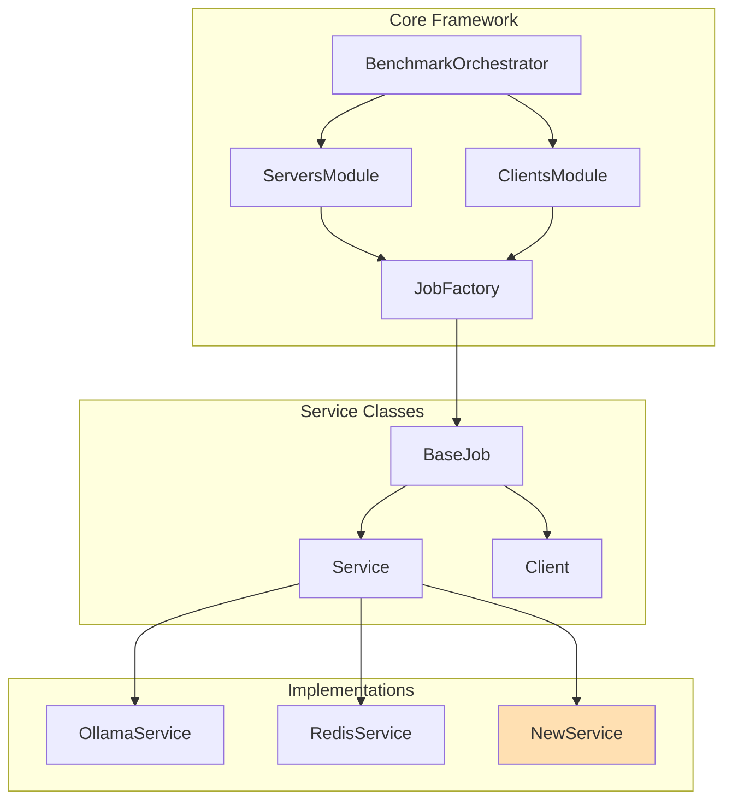

# Extending the Framework

Guide for adding new features and customizations to the orchestrator.

## Architecture Recap



## Adding a New Service

### Step 1: Create Service Class

```python
# src/services/new_service.py
from typing import List
from .base import Service
from ..base import JobFactory

class NewService(Service):
    """New service implementation"""
    
    def __init__(self, config: dict):
        super().__init__(config)
        # Extract service-specific config
        self.custom_option = config.get('custom_option', 'default')
        self.port = config.get('ports', [8080])[0]
    
    def get_service_setup_commands(self) -> List[str]:
        """Setup commands run before container starts"""
        commands = super().get_service_setup_commands()
        commands.extend([
            "",
            "# NewService setup",
            f"export NEW_SERVICE_PORT={self.port}",
            f"export CUSTOM_OPTION={self.custom_option}",
            "mkdir -p $HOME/new_service/data",
            "mkdir -p $HOME/new_service/logs",
        ])
        return commands
    
    def get_container_command(self) -> str:
        """Container execution command"""
        container_path = self._resolve_container_path()
        
        cmd_parts = [
            "apptainer exec",
            "--bind $HOME/new_service/data:/data",
            "--bind $HOME/new_service/logs:/logs",
        ]
        
        # Add GPU support if needed
        if self.resources.get('gres'):
            cmd_parts.insert(1, "--nv")
        
        cmd_parts.extend([
            container_path,
            f"new_service_binary --port {self.port}",
            "&"  # Run in background
        ])
        
        return " \\\n    ".join(cmd_parts)
    
    def get_health_check_commands(self) -> List[str]:
        """Health check after container starts"""
        return [
            "",
            "# Wait for NewService to start",
            "sleep 10",
            f"curl -s http://localhost:{self.port}/health || echo 'Health check pending'",
            "",
            f"echo 'NewService running on port {self.port}'",
        ]


# Register with JobFactory
JobFactory.register_service('new_service', NewService)
```

### Step 2: Register in `__init__.py`

```python
# src/services/__init__.py
from .new_service import NewService

__all__ = [
    # ... existing services
    'NewService',
]
```

### Step 3: Create Recipe

```yaml
# recipes/services/new_service.yaml
service:
  name: new_service
  description: "My new service"
  
  container:
    docker_source: docker://myimage:latest
    image_path: $HOME/containers/new_service.sif
  
  custom_option: "production"
  
  resources:
    cpus_per_task: 4
    mem: "8G"
    time: "02:00:00"
    partition: cpu
  
  ports:
    - 8080
```

### Step 4: Test

```bash
python main.py --verbose --recipe recipes/services/new_service.yaml
```

## Adding a New Client

### Step 1: Create Client Class

```python
# src/services/new_client.py
from typing import List
from .base import Client
from ..base import JobFactory

class NewBenchmarkClient(Client):
    """Benchmark client for NewService"""
    
    def __init__(self, config: dict):
        super().__init__(config)
        params = config.get('parameters', {})
        self.num_requests = params.get('num_requests', 1000)
        self.concurrent = params.get('concurrent', 10)
        self.output_file = params.get('output_file', '$HOME/results/new_benchmark.json')
    
    def get_benchmark_commands(self) -> List[str]:
        """Commands to run the benchmark"""
        return [
            "",
            "# NewService Benchmark",
            f"echo 'Running benchmark against {self.target_endpoint}'",
            "",
            f"python3 benchmark_scripts/new_benchmark.py \\",
            f"    --endpoint {self.target_endpoint} \\",
            f"    --requests {self.num_requests} \\",
            f"    --concurrent {self.concurrent} \\",
            f"    --output {self.output_file}",
            "",
            f"echo 'Results saved to {self.output_file}'",
        ]


# Register with JobFactory
JobFactory.register_client('new_benchmark', NewBenchmarkClient)
```

### Step 2: Create Benchmark Script

```python
# benchmark_scripts/new_benchmark.py
import argparse
import json
import time
import requests
from concurrent.futures import ThreadPoolExecutor

def run_request(endpoint):
    start = time.time()
    try:
        response = requests.get(f"{endpoint}/api/test")
        return {
            'success': response.status_code == 200,
            'latency': time.time() - start,
            'status': response.status_code
        }
    except Exception as e:
        return {'success': False, 'latency': time.time() - start, 'error': str(e)}

def main():
    parser = argparse.ArgumentParser()
    parser.add_argument('--endpoint', required=True)
    parser.add_argument('--requests', type=int, default=1000)
    parser.add_argument('--concurrent', type=int, default=10)
    parser.add_argument('--output', required=True)
    args = parser.parse_args()
    
    results = []
    with ThreadPoolExecutor(max_workers=args.concurrent) as executor:
        futures = [executor.submit(run_request, args.endpoint) 
                   for _ in range(args.requests)]
        results = [f.result() for f in futures]
    
    # Calculate statistics
    latencies = [r['latency'] for r in results if r['success']]
    output = {
        'endpoint': args.endpoint,
        'total_requests': args.requests,
        'successful': sum(1 for r in results if r['success']),
        'failed': sum(1 for r in results if not r['success']),
        'latency_avg': sum(latencies) / len(latencies) if latencies else 0,
        'latency_p99': sorted(latencies)[int(len(latencies) * 0.99)] if latencies else 0,
    }
    
    with open(args.output, 'w') as f:
        json.dump(output, f, indent=2)
    
    print(json.dumps(output, indent=2))

if __name__ == '__main__':
    main()
```

### Step 3: Create Client Recipe

```yaml
# recipes/clients/new_benchmark.yaml
client:
  name: new_benchmark
  type: new_benchmark
  
  parameters:
    num_requests: 1000
    concurrent: 10
    output_file: "$HOME/results/new_benchmark.json"
  
  resources:
    cpus_per_task: 2
    mem: "4G"
    time: "00:30:00"
    partition: cpu
```

## Customizing SLURM Script Generation

Override `generate_slurm_script()` for full control:

```python
class CustomService(Service):
    def generate_slurm_script(self) -> str:
        """Fully custom SLURM script"""
        script = [
            "#!/bin/bash",
            f"#SBATCH --job-name={self.job_id}",
            f"#SBATCH --account={self.account}",
            # ... more SBATCH directives
            "",
            "# Custom script content",
            "module load MyModule",
            "",
            "# Run service",
            "my_custom_command",
        ]
        return '\n'.join(script)
```

## Testing New Components

```bash
# Test service class instantiation
python -c "
from src.services.new_service import NewService
config = {'name': 'test', 'container': {'image_path': 'test.sif'}}
svc = NewService(config)
print(svc.get_setup_commands())
"

# Test recipe loading
python main.py --verbose --recipe recipes/services/new_service.yaml

# Check generated script
cat scripts/service_new_service_*.sh
```

---

Next: [Adding New Services](new-services.md)
