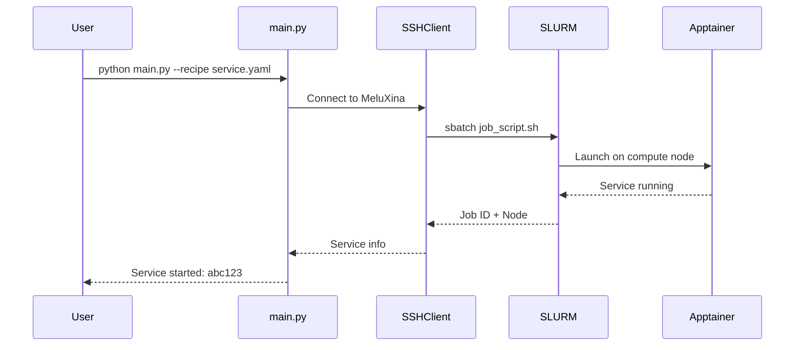

# Getting Started

This guide will help you set up and run the HPC AI Benchmarking Orchestrator on the MeluXina supercomputer.

## Overview

The HPC AI Benchmarking Orchestrator is a Python framework for deploying, benchmarking, and monitoring containerized AI services on HPC clusters. It automates the complex workflow of SLURM job submission, container management, and metrics collection.

**Key Capabilities:**

- Deploy AI services (Ollama, Redis, Chroma, MySQL) via SLURM
- Run automated benchmark workloads with configurable parameters
- Collect real-time metrics via Prometheus and cAdvisor
- Visualize performance through Grafana dashboards
- Generate benchmark reports and analysis

## System Requirements

### Local Machine

- Python 3.9+
- SSH client with key-based authentication
- Git

### HPC Cluster (MeluXina)

- SLURM workload manager
- Apptainer/Singularity for containerization
- Access to GPU nodes (for Ollama)
- Project allocation (account: `p200981` or your project)

## Quick Overview

## Workflow

1. **Configure** - Set up `config.yaml` with HPC credentials
2. **Deploy** - Start services using YAML recipes
3. **Benchmark** - Run client workloads against services
4. **Monitor** - View metrics in Grafana dashboards
5. **Analyze** - Download and process results

## Next Steps

- [Installation Guide](installation.md) - Detailed setup instructions
- [Quick Start](quickstart.md) - Run your first benchmark in 5 minutes
- [Architecture](../architecture/overview.md) - Understand the system design

---

Continue to [Installation](installation.md) →
