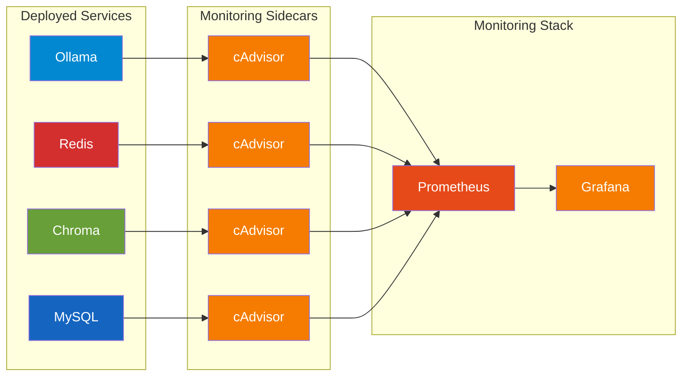

# Monitoring Overview

The orchestrator provides comprehensive monitoring through Prometheus and Grafana, collecting real-time container metrics via cAdvisor.

## Architecture



## Components

### cAdvisor

**Container Advisor** collects resource usage metrics from containers:

- CPU usage and throttling
- Memory usage and limits
- Network I/O
- Filesystem usage
- Container lifecycle

### Prometheus

Time-series database that:

- Scrapes cAdvisor endpoints every 15 seconds
- Stores metrics with configurable retention
- Provides PromQL query language
- Supports alerting (future)

### Grafana

Visualization platform with:

- Pre-built dashboards (Overview, Service, Benchmark)
- Real-time metric updates
- Customizable panels
- User-friendly interface

## Quick Start

### Option 1: Automated Script

```bash
# Start all services with monitoring
./scripts/start_all_services.sh

# Start benchmark clients
./scripts/start_all_clients.sh

# Create SSH tunnels (from script output)
ssh -L 3000:mel0164:3000 -N u103227@login.lxp.lu -p 8822  # Grafana
ssh -L 9090:mel0210:9090 -N u103227@login.lxp.lu -p 8822  # Prometheus

# Open Grafana
open http://localhost:3000
```

### Option 2: Manual Setup

```bash
# 1. Start services with cAdvisor
python main.py --recipe recipes/services/ollama_with_cadvisor.yaml
python main.py --recipe recipes/services/redis_with_cadvisor.yaml

# 2. Start Prometheus (configure monitoring_targets)
python main.py --recipe recipes/services/prometheus_with_cadvisor.yaml

# 3. Start Grafana
python main.py --recipe recipes/services/grafana.yaml

# 4. Check status
python main.py --status

# 5. Create tunnels and access
```

## Available Metrics

### CPU Metrics

| Metric | Description |
|--------|-------------|
| `container_cpu_usage_seconds_total` | Total CPU time consumed |
| `container_cpu_system_seconds_total` | System CPU time |
| `container_cpu_user_seconds_total` | User CPU time |

### Memory Metrics

| Metric | Description |
|--------|-------------|
| `container_memory_usage_bytes` | Current memory usage |
| `container_memory_working_set_bytes` | Working set size |
| `container_memory_cache` | Page cache memory |
| `container_spec_memory_limit_bytes` | Memory limit |

### Network Metrics

| Metric | Description |
|--------|-------------|
| `container_network_receive_bytes_total` | Bytes received |
| `container_network_transmit_bytes_total` | Bytes transmitted |
| `container_network_receive_packets_total` | Packets received |
| `container_network_transmit_packets_total` | Packets transmitted |

### Filesystem Metrics

| Metric | Description |
|--------|-------------|
| `container_fs_usage_bytes` | Filesystem bytes used |
| `container_fs_limit_bytes` | Filesystem size limit |

## SSH Tunnels

Since HPC compute nodes aren't directly accessible, use SSH tunnels:

```bash
# Grafana (port 3000)
ssh -i ~/.ssh/id_ed25519_mlux -L 3000:mel0164:3000 -N u103227@login.lxp.lu -p 8822

# Prometheus (port 9090)
ssh -i ~/.ssh/id_ed25519_mlux -L 9090:mel0210:9090 -N u103227@login.lxp.lu -p 8822
```

Then access:

- Grafana: [http://localhost:3000](http://localhost:3000)
- Prometheus: [http://localhost:9090](http://localhost:9090)

## Querying Metrics

### Via CLI

```bash
python main.py --query-metrics prometheus_xxx "container_memory_usage_bytes"
```

### Via Prometheus UI

Navigate to [http://localhost:9090](http://localhost:9090) and enter PromQL queries.

### Via Grafana

Use the Explore feature or dashboard panels.

---

Next: [Grafana Dashboards](grafana.md) | [Prometheus Metrics](prometheus.md)
