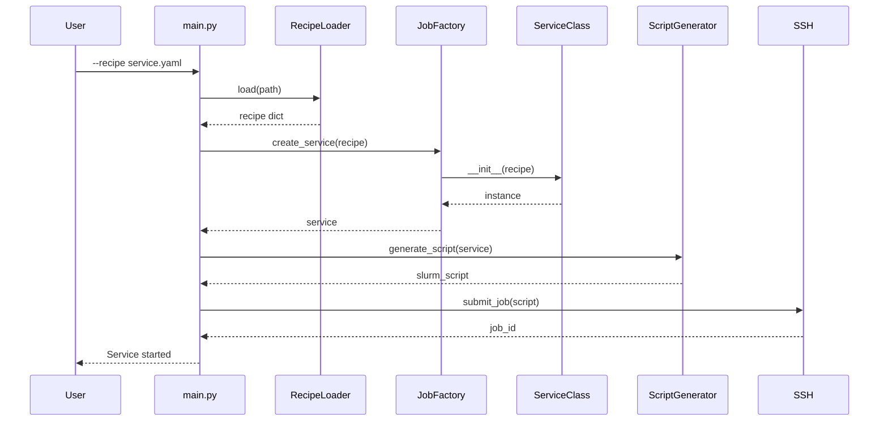

# Recipes Overview

Recipes are YAML configuration files that define how services and clients are deployed on the HPC cluster.

## What Are Recipes?

Recipes provide a declarative way to specify:

- **Container configuration**: Image source and path
- **Resource allocation**: CPU, memory, GPU, time limits
- **Environment variables**: Service-specific settings
- **Network ports**: Exposed endpoints
- **Monitoring**: cAdvisor integration

## Recipe Types

| Type | Location | Purpose |
|------|----------|---------|
| **Service** | `recipes/services/` | Deploy persistent services (Ollama, Redis, etc.) |
| **Client** | `recipes/clients/` | Run benchmark workloads |

## Directory Structure

```
recipes/
├── services/
│   ├── ollama.yaml
│   ├── ollama_with_cadvisor.yaml
│   ├── redis.yaml
│   ├── redis_with_cadvisor.yaml
│   ├── chroma.yaml
│   ├── chroma_with_cadvisor.yaml
│   ├── mysql.yaml
│   ├── mysql_with_cadvisor.yaml
│   ├── prometheus_with_cadvisor.yaml
│   └── grafana.yaml
└── clients/
    ├── ollama_benchmark.yaml
    ├── ollama_parametric.yaml
    ├── redis_benchmark.yaml
    ├── redis_parametric.yaml
    ├── chroma_benchmark.yaml
    ├── chroma_parametric.yaml
    └── mysql_benchmark.yaml
```

## Basic Recipe Structure

### Service Recipe

```yaml
service:
  name: service_name
  description: "Human-readable description"
  
  # Container image
  container:
    docker_source: docker://image:tag
    image_path: $HOME/containers/image.sif
  
  # SLURM resources
  resources:
    nodes: 1
    ntasks: 1
    cpus_per_task: 4
    mem: "16G"
    time: "02:00:00"
    partition: gpu
    qos: default
    gres: "gpu:1"
  
  # Environment variables
  environment:
    VAR_NAME: "value"
  
  # Network
  ports:
    - 8080
  
  # Monitoring (optional)
  enable_cadvisor: true
  cadvisor_port: 8080
```

### Client Recipe

```yaml
client:
  name: client_name
  type: benchmark_type
  description: "Benchmark description"
  
  # Benchmark parameters
  parameters:
    param1: value1
    param2: value2
    output_file: "$HOME/results/output.json"
  
  # SLURM resources
  resources:
    cpus_per_task: 2
    mem: "4G"
    time: "00:30:00"
    partition: cpu
```

## Using Recipes

### Start a Service

```bash
python main.py --recipe recipes/services/ollama.yaml
```

### Run a Client

```bash
python main.py --recipe recipes/clients/ollama_benchmark.yaml --target-service ollama_xxx
```

### With Verbose Output

```bash
python main.py --verbose --recipe recipes/services/redis.yaml
```

## Recipe Processing Flow



## Validation

Recipes are validated for:

- Required fields (name, container)
- Valid resource values
- Correct YAML syntax
- Environment variable format

---

Next: [Service Recipes](services.md) | [Client Recipes](clients.md)
