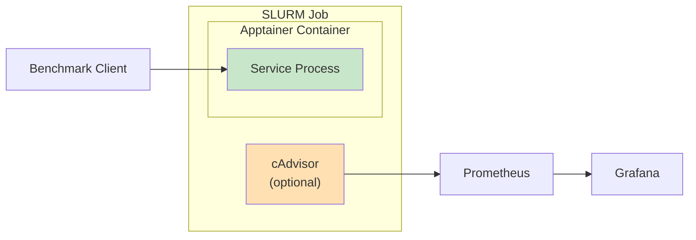
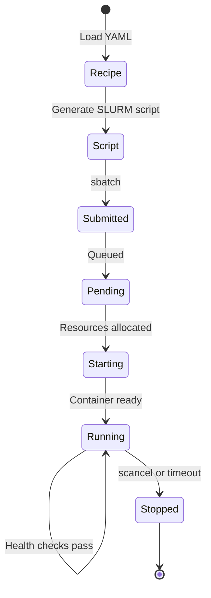

# Services Overview

The orchestrator supports multiple AI and database services, each optimized for HPC deployment via Apptainer containers.

## Available Services

| Service | Type | Default Port | GPU Required | Description |
|---------|------|--------------|--------------|-------------|
| [Ollama](ollama.md) | LLM Inference | 11434 | Yes | High-performance LLM server |
| [Redis](redis.md) | In-Memory DB | 6379 | No | Key-value store with persistence |
| [Chroma](chroma.md) | Vector DB | 8000 | No | Vector similarity search |
| [MySQL](mysql.md) | RDBMS | 3306 | No | Relational database |
| [Prometheus](prometheus.md) | Monitoring | 9090 | No | Metrics collection |
| [Grafana](grafana.md) | Visualization | 3000 | No | Dashboard visualization |

## Service Architecture

Each service follows a common pattern:



## Common Configuration

All services share these common recipe fields:

```yaml
service:
  name: service_name
  description: "Service description"
  
  # Container configuration
  container:
    docker_source: docker://image:tag
    image_path: $HOME/containers/image.sif
  
  # SLURM resources
  resources:
    nodes: 1
    ntasks: 1
    cpus_per_task: 4
    mem: "16G"
    time: "02:00:00"
    partition: gpu  # or cpu
    qos: default
  
  # Environment variables
  environment:
    VAR_NAME: "value"
  
  # Exposed ports
  ports:
    - 8080
  
  # Optional monitoring
  enable_cadvisor: true
  cadvisor_port: 8080
```

## Service Lifecycle



## Monitoring Integration

Services can be deployed with cAdvisor for container metrics:

```yaml
service:
  name: ollama
  enable_cadvisor: true
  cadvisor_port: 8080
```

This enables collection of:

- **CPU Usage**: `container_cpu_usage_seconds_total`
- **Memory Usage**: `container_memory_usage_bytes`
- **Network I/O**: `container_network_*_bytes_total`
- **Filesystem**: `container_fs_usage_bytes`

## Quick Start Commands

```bash
# List available services
python main.py --list-services

# Start a service
python main.py --recipe recipes/services/ollama.yaml

# Check status
python main.py --status

# Stop a service
python main.py --stop-service <service_id>
```

## Service-Specific Documentation

- [Ollama (LLM)](ollama.md) - GPU-accelerated language model inference
- [Redis](redis.md) - In-memory database with benchmarking
- [Chroma](chroma.md) - Vector similarity search
- [MySQL](mysql.md) - Relational database
- [Prometheus](prometheus.md) - Metrics collection and storage
- [Grafana](grafana.md) - Visualization and dashboards
