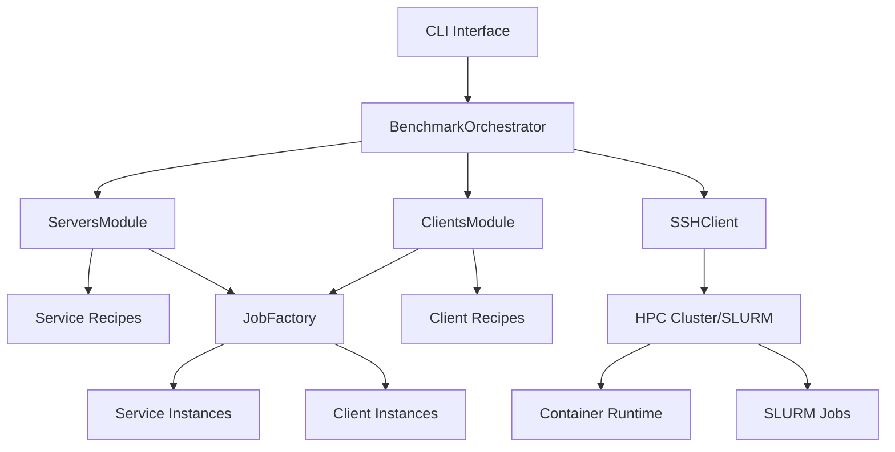
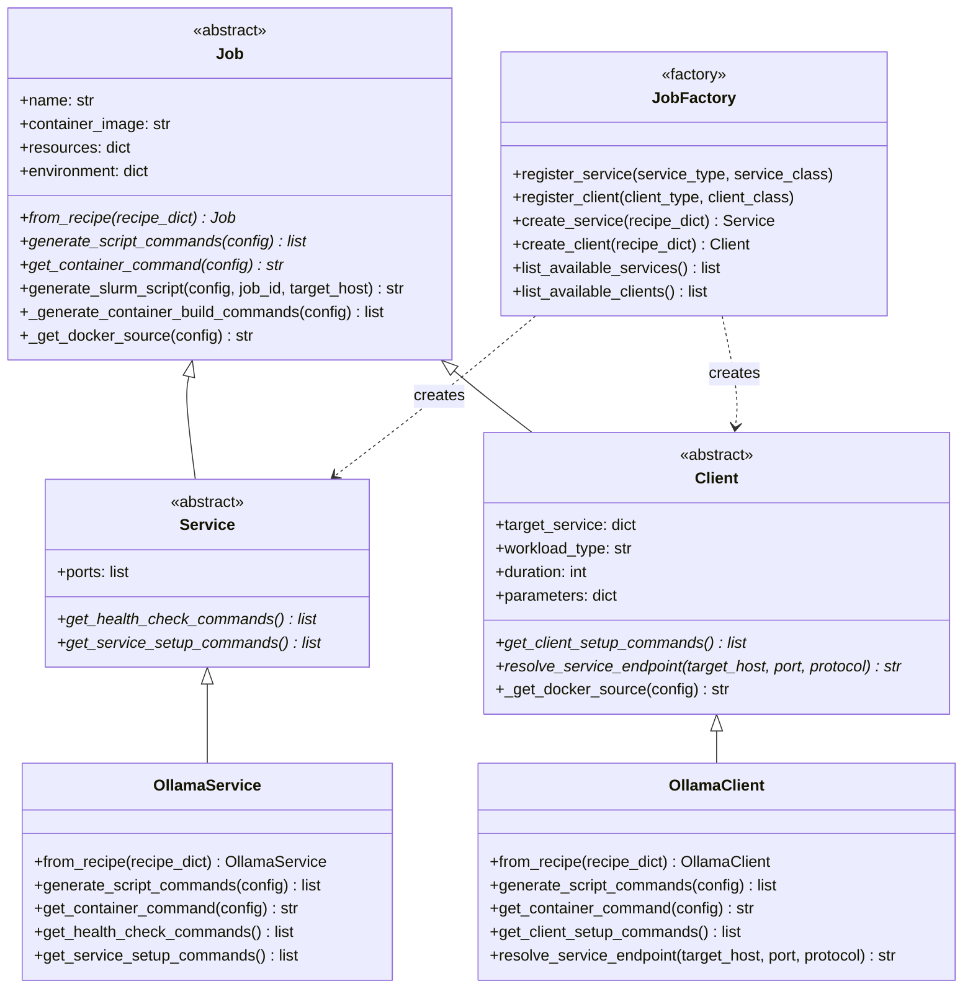
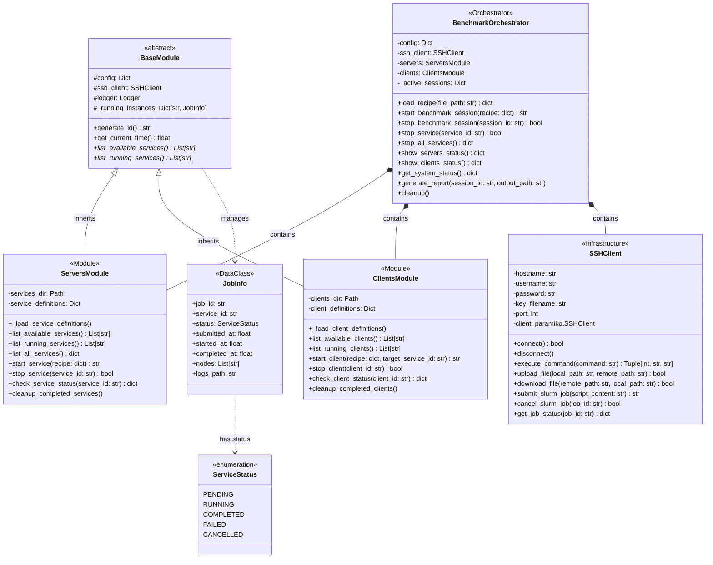
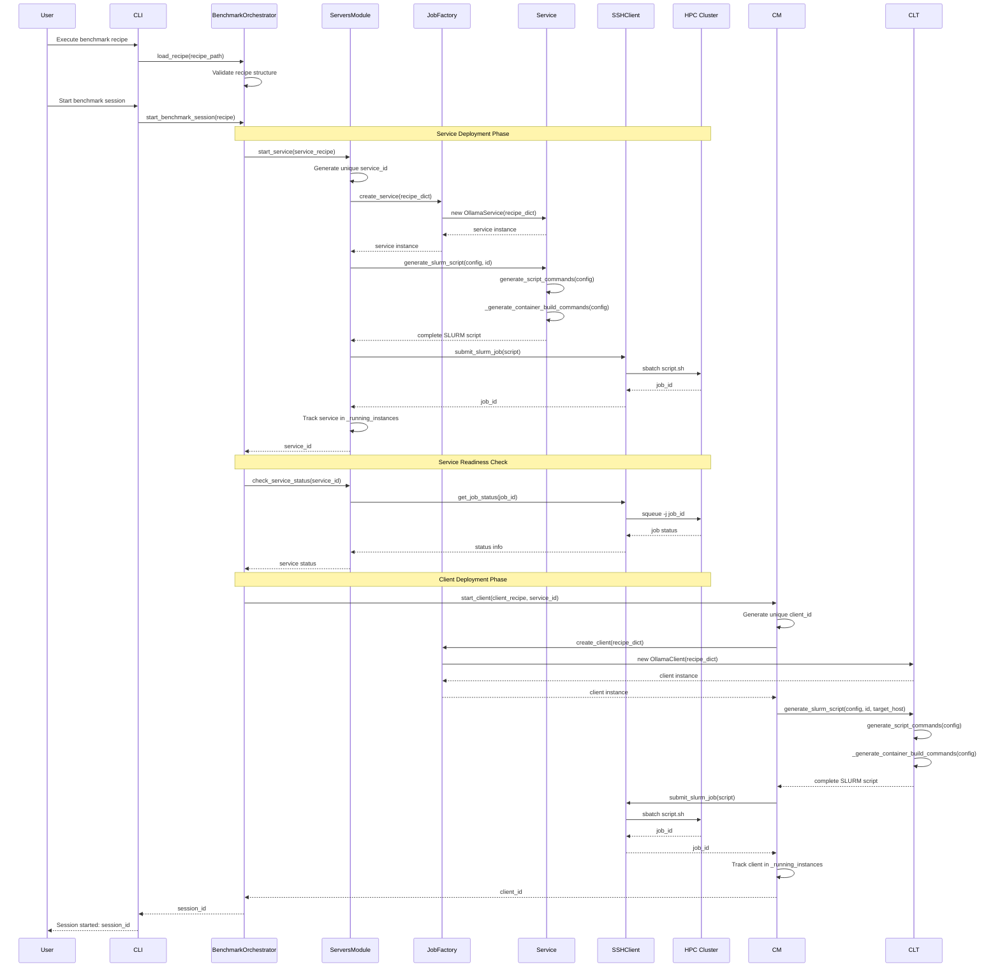
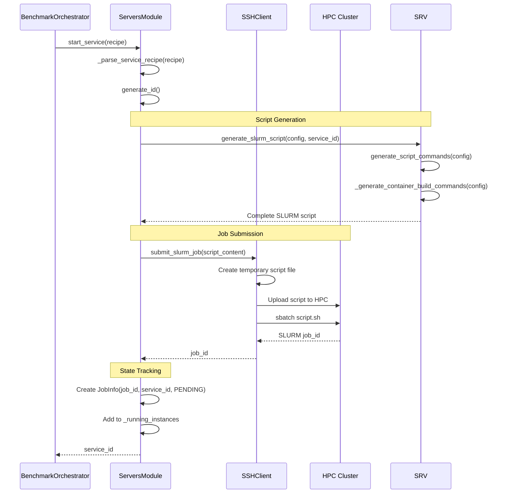
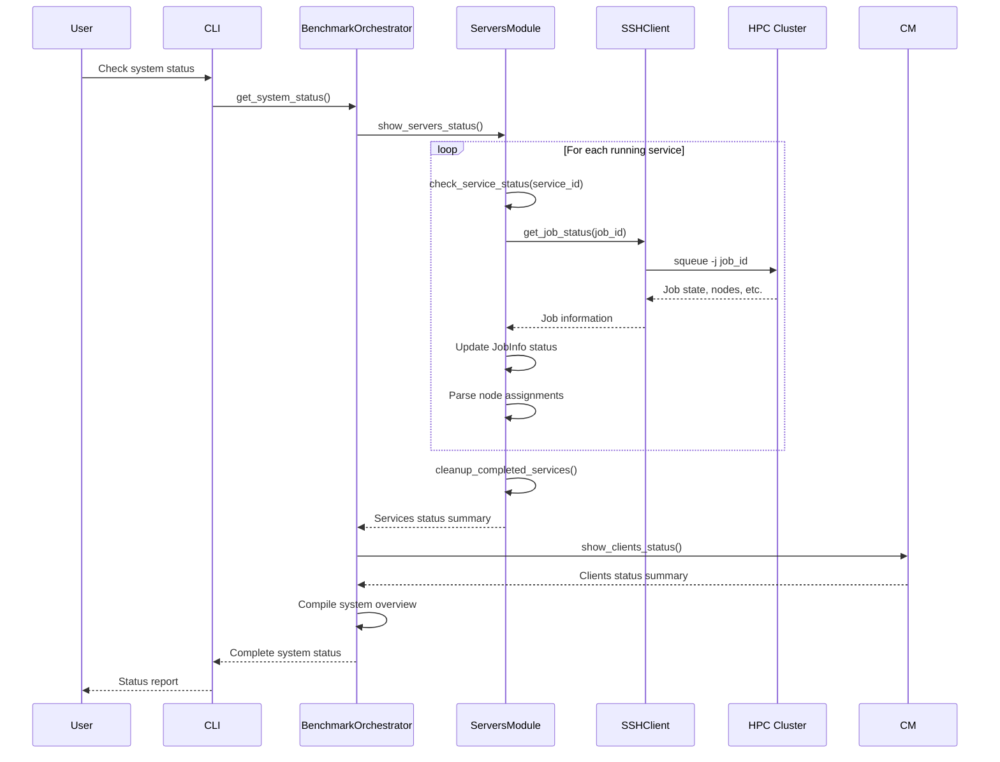
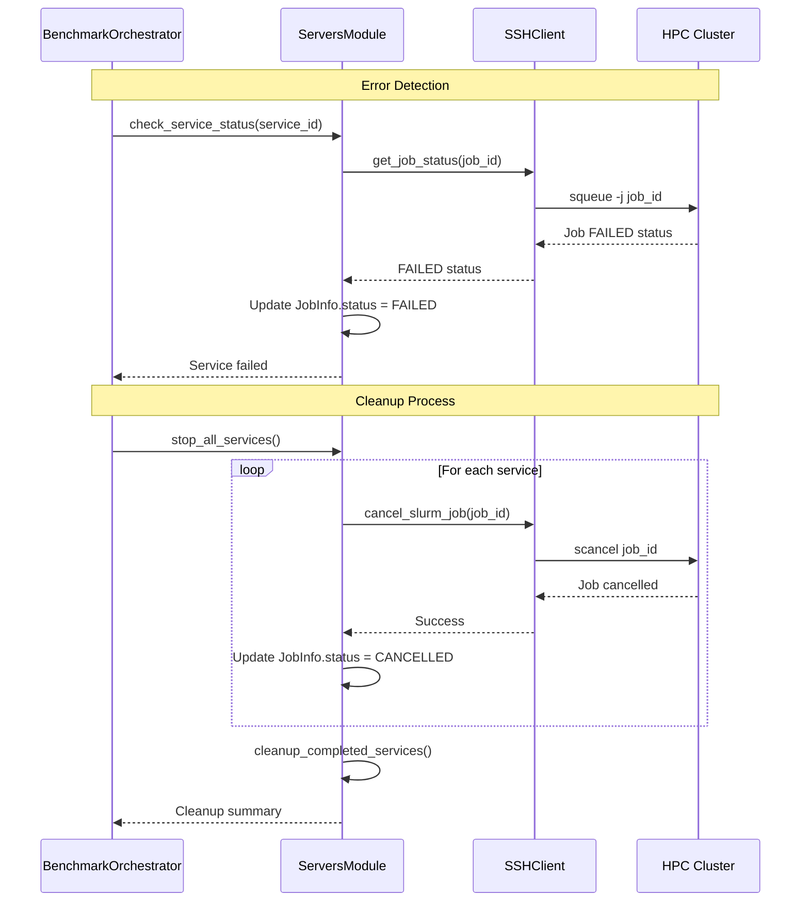

# HPC Benchmarking Orchestrator - Architecture Documentation

## Overview

The HPC Benchmarking Orchestrator is a sophisticated system designed to manage containerized services and benchmark workloads on High-Performance Computing (HPC) clusters using SLURM. The system provides automated deployment, monitoring, and lifecycle management of distributed benchmarking experiments.

The architecture is built around a **Job-based inheritance hierarchy** with a **factory pattern** for creating service and client instances, providing a clean separation of concerns and extensible design.

<span style="background-color: #fff9b1; font-size: 1.35em; font-weight: bold;">
TODO: Monitor and Logs are not taken into account for now, and CLI interface is though as a minimal interface to run tests
</span>

## System Architecture

### High-Level Architecture



### Core Components

1. **BenchmarkOrchestrator**: Central orchestration engine
2. **ServersModule**: Manages service deployments using JobFactory
3. **ClientsModule**: Manages benchmark client workloads using JobFactory
4. **JobFactory**: Creates Service/Client instances based on recipe type
5. **SSHClient**: Handles remote HPC communication
6. **Job Instances**: Each job generates its own SLURM batch scripts
7. **BaseModule**: Abstract base class for orchestrator modules

## Class Diagram

### Job Hierarchy and Factory Pattern



### Core System Classes



### Simplified Component View

```mermaid
graph TD
    %% Main Components
    BO[🎯 BenchmarkOrchestrator<br/>Central Orchestration Engine]
    SM[🖥️ ServersModule<br/>Service Management]
    CM[📊 ClientsModule<br/>Benchmark Client Management]
    SSH[🔐 SSHClient<br/>HPC Communication]
    JF[🏭 JobFactory<br/>Service/Client Factory]
    
    %% Job Hierarchy
    JOB[📋 Job<br/>Abstract Base Class]
    SRV[🚀 Service<br/>Service Jobs]
    CLT[🎯 Client<br/>Client Jobs]
    OSRV[🤖 OllamaService<br/>Concrete Service]
    OCLT[🧪 OllamaClient<br/>Concrete Client]
    
    %% Data Components
    JI[📋 JobInfo<br/>Job Tracking]
    
    %% Relationships
    BO --> SM
    BO --> CM
    BO --> SSH
    SM --> JF
    CM --> JF
    SM --> JI
    CM --> JI
    
    JOB --> SRV
    JOB --> CLT
    SRV --> OSRV
    CLT --> OCLT
    JF ..> SRV
    JF ..> CLT
    
    %% External Systems
    SSH --> HPC[🏢 HPC Cluster<br/>SLURM Workload Manager]
    
    %% Styling
    classDef orchestrator fill:#e1f5fe,stroke:#01579b,stroke-width:3px
    classDef module fill:#f3e5f5,stroke:#4a148c,stroke-width:2px
    classDef infrastructure fill:#e8f5e8,stroke:#1b5e20,stroke-width:2px
    classDef factory fill:#fff3e0,stroke:#e65100,stroke-width:2px
    classDef job fill:#fce4ec,stroke:#880e4f,stroke-width:2px
    classDef external fill:#ffebee,stroke:#c62828,stroke-width:2px
    
    class BO orchestrator
    class SM,CM module
    class SSH infrastructure
    class JF factory
    class JOB,SRV,CLT,OSRV,OCLT job
    class JI config
    class HPC external
```

## Sequence Diagrams

### 1. Benchmark Session Lifecycle (New Job-Based Architecture)



### 2. Service Deployment Flow



### 3. Status Monitoring Flow



### 4. Error Handling and Cleanup



## Key Design Patterns
<span style="background-color: #fff9b1; font-size: 1.35em; font-weight: bold;">
This whole part is to be revised when we'll actually start writing code
</span>

### 1. **Abstract Factory Pattern**
- `BaseModule` serves as an abstract base for `ServersModule` and `ClientsModule`
- Provides common interface for service management across different module types

### 2. **Job Factory Pattern (New Architecture)**
- `JobFactory` creates Service and Client instances based on recipe types
- Centralized registration system for new service/client types
- Clean separation between creation logic and business logic

### 3. **Inheritance Hierarchy Pattern (New Architecture)**
- Abstract `Job` base class defines common interface
- `Service` and `Client` abstract classes provide specialized behavior  
- Concrete implementations (`OllamaService`, `OllamaClient`) handle specific workflows
- Polymorphic behavior through abstract methods

### 4. **Strategy Pattern**
- Each concrete Job class implements its own script generation strategy
- Job instances handle their own SLURM script generation
- Configurable SLURM parameters based on job type and requirements

### 5. **Template Method Pattern (New Architecture)**
- `generate_slurm_script` in Job base class provides template for script generation
- Concrete Job classes fill in job-specific details via `generate_script_commands`
- Consistent script structure across different job types

### 6. **Observer Pattern**
- Status monitoring through periodic SLURM queries
- Event-driven updates to service and client states

### 7. **Command Pattern**
- SSH operations encapsulated as commands
- SLURM job operations abstracted through SSH interface

## Extensibility and Adding New Services

### Adding a New Service Type

1. **Create Service Class**:
```python
class MyNewService(Service):
    def generate_slurm_directives(self, slurm_config: dict) -> List[str]:
        # Return service-specific SLURM directives
        directives = [
            "#!/bin/bash -l",
            f"#SBATCH --job-name={self.get_name()}",
            # Add service-specific SLURM directives
        ]
        return directives
    
    def generate_container_commands(self, script_generator) -> List[str]:
        # Return service-specific container commands
        commands = [
            "# Service-specific setup",
            f"apptainer exec {self.get_container_image()} {self.get_command()}",
            # Add service-specific logic
        ]
        return commands
```

2. **Register with Factory**:
```python
from services import JobFactory
JobFactory.register_service("my_new_service", MyNewService)
```

3. **Create Service Recipe**:
```yaml
service:
  type: my_new_service
  name: "My New Service"
  container_image: "my_new_service.sif"
  command: "my_service_command"
  resources:
    time: "01:00:00"
    partition: "gpu"
    nodes: 1
```

### Adding a New Client Type

1. **Create Client Class**:
```python
class MyNewClient(Client):
    def generate_slurm_directives(self, slurm_config: dict) -> List[str]:
        # Return client-specific SLURM directives
        directives = [
            "#!/bin/bash -l", 
            f"#SBATCH --job-name={self.get_name()}_benchmark",
            # Add client-specific SLURM directives
        ]
        return directives
    
    def generate_container_commands(self, script_generator) -> List[str]:
        # Return client-specific container commands
        commands = [
            "# Client-specific setup",
            "# Benchmark execution logic",
            f"apptainer exec {self.get_container_image()} python /app/my_benchmark.py",
            # Add result collection
        ]
        return commands
```

2. **Register with Factory**:
```python
from services import JobFactory
JobFactory.register_client("my_new_client", MyNewClient)
```

3. **Create Client Recipe**:
```yaml
client:
  type: my_new_client
  name: "My New Benchmark Client"
  workload_type: "my_new_benchmark"
  container_image: "benchmark_client.sif"
  target_service:
    type: "my_new_service"
    port: 8080
  parameters:
    benchmark_duration: 300
    test_mode: "stress"
```

### Benefits of the New Architecture

1. **Extensibility**: Easy to add new service and client types without modifying existing code
2. **Maintainability**: Clean separation of concerns with single responsibility principle
3. **Testability**: Each job type can be tested independently with mock dependencies
4. **Reusability**: Common functionality shared through inheritance hierarchy
5. **Flexibility**: Job-specific behavior can be customized without affecting other job types
6. **Type Safety**: Strong typing through abstract base classes ensures interface compliance

## Data Flow Architecture

### Configuration Flow
1. **Config Loading**: YAML configuration files loaded at startup
2. **Recipe Processing**: Service and client recipes parsed from YAML
3. **Script Generation**: Dynamic SLURM script creation based on configurations
4. **Resource Allocation**: SLURM directives generated based on resource requirements

### Job Lifecycle Flow
1. **Submission**: SLURM jobs submitted via SSH
2. **Tracking**: Job IDs stored in internal state
3. **Monitoring**: Periodic status updates via SLURM queries
4. **Cleanup**: Completed/failed jobs removed from tracking

### Communication Flow
1. **CLI → Orchestrator**: User commands processed
2. **Orchestrator → Modules**: Delegated operations
3. **Modules → SSH**: Remote execution
4. **SSH → HPC**: SLURM operations

## Error Handling Strategy

### Hierarchical Error Management
- **Connection Errors**: SSH connectivity issues handled at client level
- **Job Errors**: SLURM job failures tracked in JobInfo status
- **Configuration Errors**: Recipe validation before execution
- **Resource Errors**: Graceful handling of resource allocation failures

### Recovery Mechanisms
- **Automatic Retry**: Failed SSH operations retried with backoff
- **State Cleanup**: Orphaned jobs detected and cleaned up
- **Graceful Degradation**: System continues operation with partial failures

## Performance Considerations

### Scalability
- **Concurrent Operations**: Multiple services/clients managed simultaneously
- **Resource Optimization**: Dynamic resource allocation based on requirements
- **State Management**: Efficient tracking of large numbers of jobs

### Monitoring Overhead
- **Lazy Evaluation**: Status updates only when requested
- **Batch Operations**: Multiple SLURM queries combined where possible
- **Caching**: Service definitions cached in memory

## Security Model

### Authentication
- **SSH Key-based**: Secure key-based authentication to HPC clusters
- **User Isolation**: Jobs run under authenticated user context
- **Network Security**: Container networking configured for secure communication

### Authorization
- **SLURM ACLs**: Resource access controlled by SLURM policies
- **Container Isolation**: Services isolated through container boundaries
- **File Permissions**: Proper permissions for scripts and data files