# HPC Benchmarking Orchestrator - Architecture Documentation

## Overview

The HPC Benchmarking Orchestrator is a sophisticated system designed to manage containerized services and benchmark workloads on High-Performance Computing (HPC) clusters using SLURM. The system provides automated deployment, monitoring, and lifecycle management of distributed benchmarking experiments.

TODO: Monitor and Logs are not taken into account for now, and CLI interface is though as a minimal interface to run tests

## System Architecture

### High-Level Architecture


### Core Components

1. **BenchmarkOrchestrator**: Central orchestration engine
2. **ServersModule**: Manages service deployments
3. **ClientsModule**: Manages benchmark client workloads
4. **SSHClient**: Handles remote HPC communication
5. **ScriptGenerator**: Generates SLURM batch scripts
6. **BaseModule**: Abstract base class for modules

## Class Diagram

### Core System Classes


```

### Simplified Component View

```mermaid
graph TD
    %% Main Components
    BO[🎯 BenchmarkOrchestrator<br/>Central Orchestration Engine]
    SM[🖥️ ServersModule<br/>Service Management]
    CM[📊 ClientsModule<br/>Benchmark Client Management]
    SSH[🔐 SSHClient<br/>HPC Communication]
    SG[📝 ScriptGenerator<br/>SLURM Script Generation]
    
    %% Data Components
    SC[⚙️ ServiceConfig<br/>Service Configuration]
    CC[⚙️ ClientConfig<br/>Client Configuration]
    JI[📋 JobInfo<br/>Job Tracking]
    
    %% Relationships
    BO --> SM
    BO --> CM
    BO --> SSH
    SM --> SG
    CM --> SG
    SM --> SC
    CM --> CC
    SM --> JI
    CM --> JI
    
    %% External Systems
    SSH --> HPC[🏢 HPC Cluster<br/>SLURM Workload Manager]
    
    %% Styling
    classDef orchestrator fill:#e1f5fe,stroke:#01579b,stroke-width:3px
    classDef module fill:#f3e5f5,stroke:#4a148c,stroke-width:2px
    classDef infrastructure fill:#e8f5e8,stroke:#1b5e20,stroke-width:2px
    classDef config fill:#fff3e0,stroke:#e65100,stroke-width:2px
    classDef external fill:#ffebee,stroke:#c62828,stroke-width:2px
    
    class BO orchestrator
    class SM,CM module
    class SSH,SG infrastructure
    class SC,CC,JI config
    class HPC external
```



## Sequence Diagrams

### 1. Benchmark Session Lifecycle


### 2. Service Deployment Flow


### 3. Status Monitoring Flow


### 4. Error Handling and Cleanup


## Key Design Patterns

### 1. **Abstract Factory Pattern**
- `BaseModule` serves as an abstract base for `ServersModule` and `ClientsModule`
- Provides common interface for service management across different module types

### 2. **Strategy Pattern**
- `ScriptGenerator` implements different script generation strategies
- Configurable SLURM parameters based on resource requirements

### 3. **Observer Pattern**
- Status monitoring through periodic SLURM queries
- Event-driven updates to service and client states

### 4. **Command Pattern**
- SSH operations encapsulated as commands
- SLURM job operations abstracted through SSH interface

## Data Flow Architecture

### Configuration Flow
1. **Config Loading**: YAML configuration files loaded at startup
2. **Recipe Processing**: Service and client recipes parsed from YAML
3. **Script Generation**: Dynamic SLURM script creation based on configurations
4. **Resource Allocation**: SLURM directives generated based on resource requirements

### Job Lifecycle Flow
1. **Submission**: SLURM jobs submitted via SSH
2. **Tracking**: Job IDs stored in internal state
3. **Monitoring**: Periodic status updates via SLURM queries
4. **Cleanup**: Completed/failed jobs removed from tracking

### Communication Flow
1. **CLI → Orchestrator**: User commands processed
2. **Orchestrator → Modules**: Delegated operations
3. **Modules → SSH**: Remote execution
4. **SSH → HPC**: SLURM operations

## Error Handling Strategy

### Hierarchical Error Management
- **Connection Errors**: SSH connectivity issues handled at client level
- **Job Errors**: SLURM job failures tracked in JobInfo status
- **Configuration Errors**: Recipe validation before execution
- **Resource Errors**: Graceful handling of resource allocation failures

### Recovery Mechanisms
- **Automatic Retry**: Failed SSH operations retried with backoff
- **State Cleanup**: Orphaned jobs detected and cleaned up
- **Graceful Degradation**: System continues operation with partial failures

## Performance Considerations

### Scalability
- **Concurrent Operations**: Multiple services/clients managed simultaneously
- **Resource Optimization**: Dynamic resource allocation based on requirements
- **State Management**: Efficient tracking of large numbers of jobs

### Monitoring Overhead
- **Lazy Evaluation**: Status updates only when requested
- **Batch Operations**: Multiple SLURM queries combined where possible
- **Caching**: Service definitions cached in memory

## Security Model

### Authentication
- **SSH Key-based**: Secure key-based authentication to HPC clusters
- **User Isolation**: Jobs run under authenticated user context
- **Network Security**: Container networking configured for secure communication

### Authorization
- **SLURM ACLs**: Resource access controlled by SLURM policies
- **Container Isolation**: Services isolated through container boundaries
- **File Permissions**: Proper permissions for scripts and data files

## Deployment Architecture

### Container Management
- **Singularity Integration**: Native support for Singularity containers
- **Image Building**: Automatic container building on HPC nodes
- **Registry Support**: Support for container registries and local images

### Resource Management
- **GPU Allocation**: Automatic GPU resource allocation for workloads
- **Memory Management**: Dynamic memory allocation based on service requirements
- **Network Configuration**: Automatic port allocation and networking setup

This architecture provides a robust, scalable, and maintainable foundation for managing complex benchmarking experiments on HPC infrastructure.